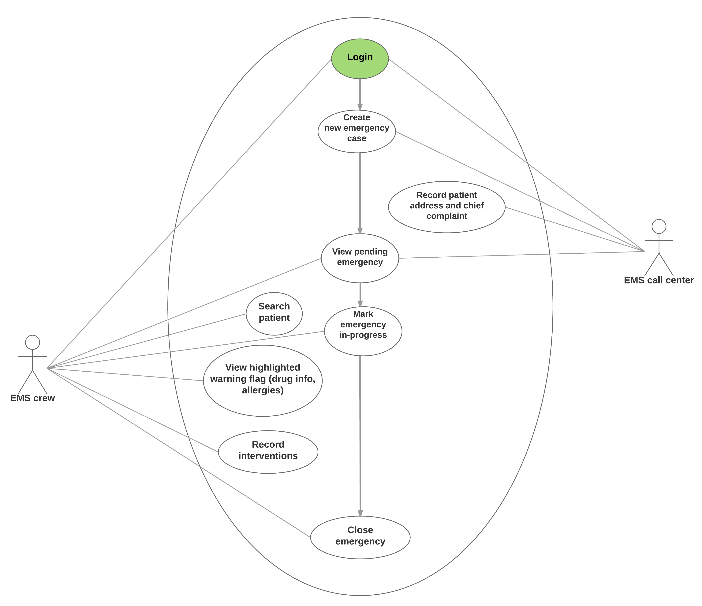
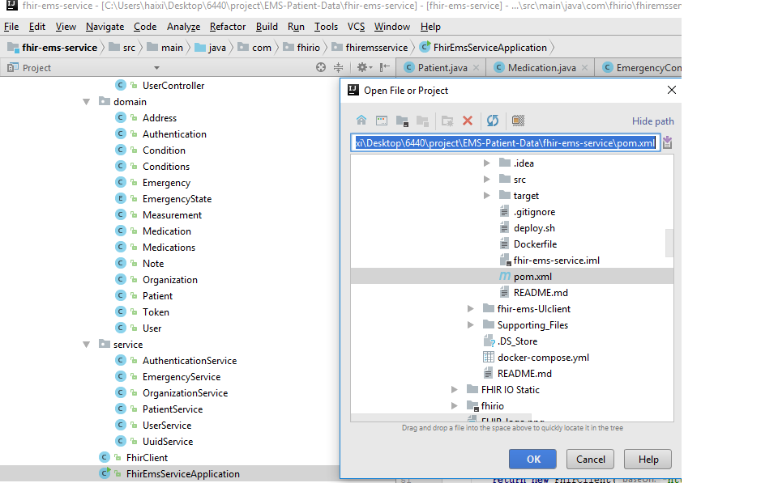
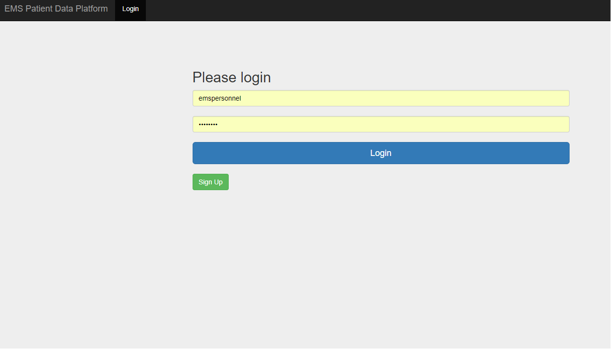
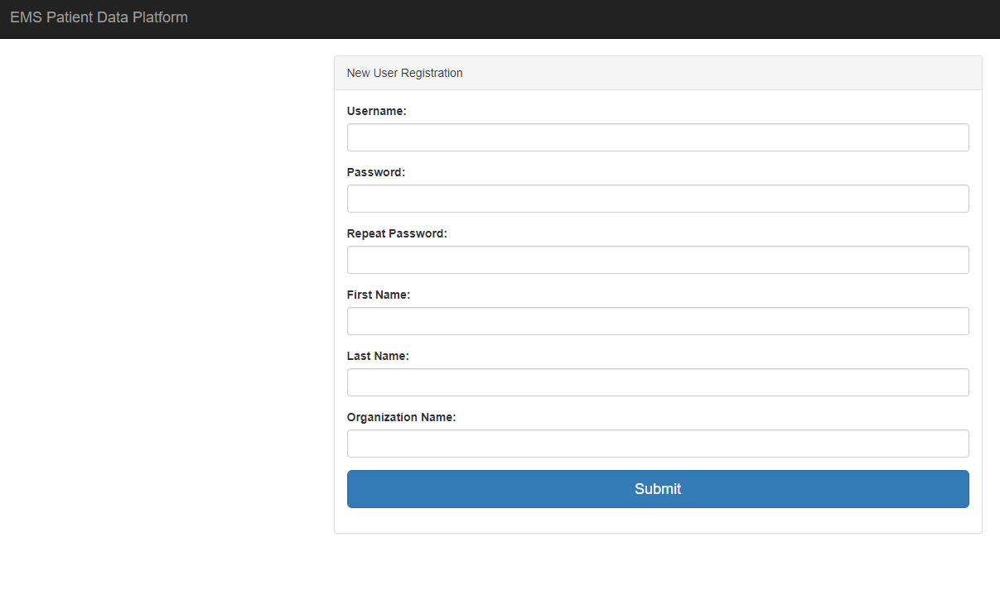
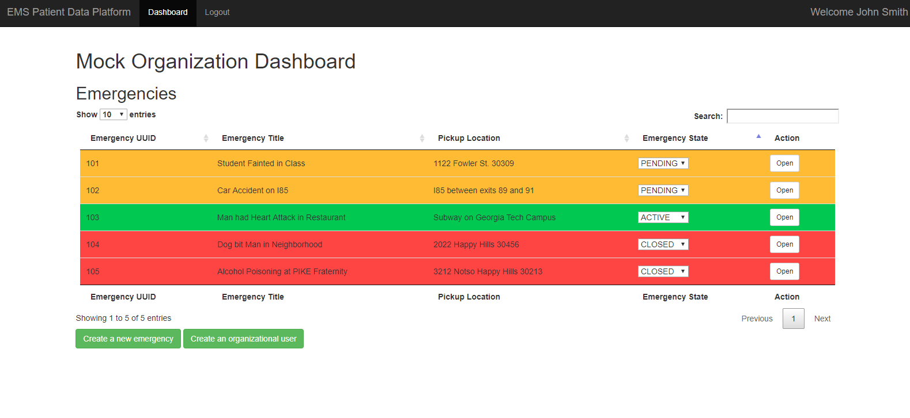
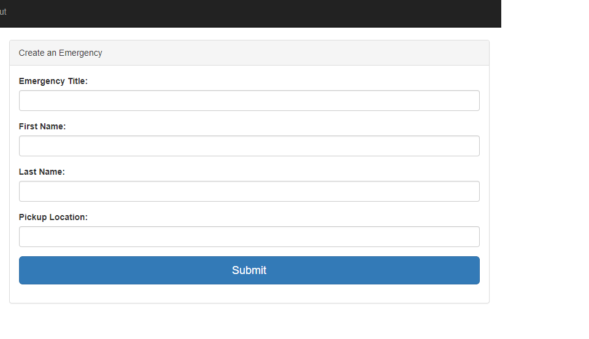
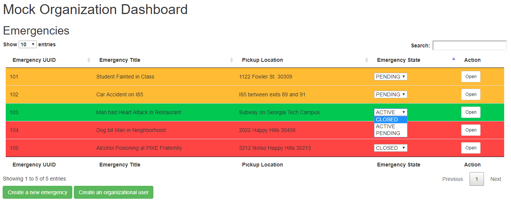
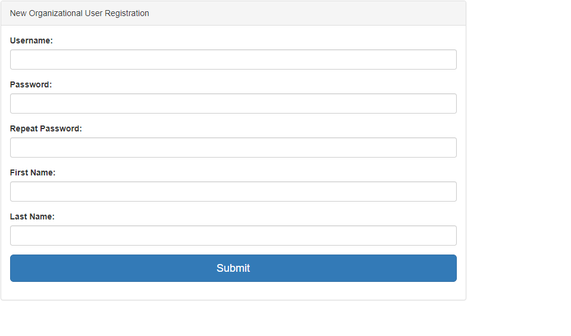
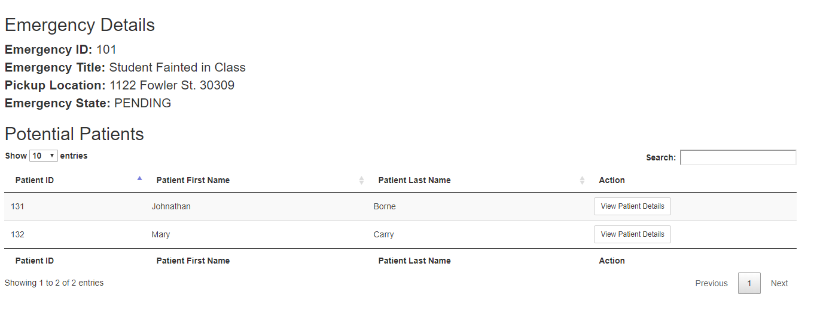
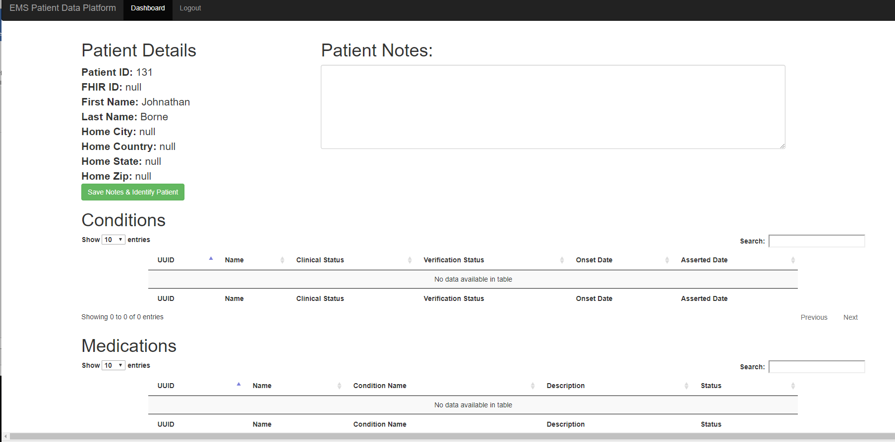

# USER MANUAL
> 
>
> Team Name: FHIR I/O
>
> Project Name: EMS Patient Data
>
> Team Members:
>1. Bryce Montano - bmontano6
>1. Juan San Emeterio - jjse3
>1. Haixia Shang - hshang7
>1. Yu Wang - ywang3134
>1. Smitha George - sgeorge65
>
> GitHub link: https://github.gatech.edu/gt-hit-fall2017/EMS-Patient-Data

**Revision Sheet**

|                 |          |                          |
|-----------------|----------|--------------------------|
| **Release No.** | **Date** | **Revision Description** |
| Rev. 0          | 11/28/17 | User’s Manual Created    |
| Rev. 1          |          |                          |
| Rev. 2          |          |                          |
|                 |          |                          |

    
# 1.  GENERAL INFORMATION

## 1.1 System Overview
The EMS-Patient-Data Suite is an application that utilizes an intuitive
user interface that makes the first responders who cater to emergency
calls and high-risk transportations get quick access to patient data
including pick-up location, conditions, treatments and EMS responses.
imputing and editing records fast and efficient. This program provides
Patient lookup and search by cross matching address, patient name and/or
other potential identifiers. A single dashboard covering all patient
information collating multiple providers, hospitals, physician and
different illnesses is provided. That allows users to gather necessary
information and store/update it electronically to make quick medical
decisions, and exterminate the need for using records.

This program uses a client/server based model. The client is the user
who takes the emergency calls and the user who take care the patient in
the emergency vehicles. The client program will communicate with a FHIR
server that get all the information for each potential patient. The
information saved in the database is about patients who receive services
from EMS. It includes some of their personal information (i.e. name,
address, etc.), illness history, notes about their case, and any
medications they have or are using.

## 1.2 Acronyms and Abbreviations
EMS – Emergency Medical Services. Provides services to patients who have
medical emergencies.

FHIR - Fast Healthcare Interoperability Resources, which is a standard
for exchanging healthcare information electronically. In this
application, the following resource is used:

http://fhirtesting.hdap.gatech.edu/hapi-fhir-jpaserver-example/baseDstu3

Observations –  a central element in healthcare, used to support
diagnosis, monitor progress, determine baselines and patterns and even
capture demographic characteristics. Most observations are simple
name/value pair assertions with some metadata, but some observations
group other observations together logically, or even are multi-component
observations.

# 2. SYSTEM SUMMARY

## 2.1 System Configuration
Each user uses their own computer running Windows OS/Linux. On those
computers is the client application that will connect to a FHIR Server
database.

     
## 2.2 User Access Levels

There are two different types of users. Super Users are users who have
authority to create organization to access the system. Organizational
Users refers to staffs/ employees working in a specific organization who
have authority to access the records in their organization. The Super
Users are still Organizational users employees, but are part of the
administration of the organization.

# 3. GETTING STARTED
## 3.1 Setting up the Application
There are two ways to setting up the application.

**The first way** starts by installing Docker Compose. This will begin
the installation of Docker. Please follow this guide:
<https://docs.docker.com/compose/install/#prerequisites>

-To run the services, simply cd to the ./EMS-Patient-Data and run:

*sudo docker-compose up –build*

-Go to <http://localhost:8080/index.html>

-To stop the service,

*sudo docker-compose down*

**The second way** is using Java IDE, such as Eclipse or IntelliJ,
importing the Maven project. Using IntelliJ as example:

1.  On the main menu, select **File | Open**.

2.  In the dialog that
    opens, select the **pom.xml** of the
    project (./fhir-ems-service/pom.xml). Click **OK**.

1.  On the first
    page of the **Import
    Project** wizard, in the **Import Project from External
    model** select **Maven** and click **Next**. (This page is not displayed if you selected
    the **pom.xml**.)

2.  Specify Maven settings
    or use the default selection.  
    The default settings are usually sufficient for a project. However,
    you can select the following (frequently used) options:

    -   **Import Maven
        projects automatically** - if you select this option, the
        project is imported automatically every time you make changes to
        your POM file and you don't need to control manually when to
        import the changes. However, note that it might take some time
        to re-import the project.

Click **Next**.

1.  IntelliJ IDEA displays
    the found projects and you can select the ones you need to import.  
    Click **Next**.

2.  Specify the project's
    SDK and click **Next**.

3.  Specify a name and the
    location of the application. 

Click **Finish**

1.  Run
    *FhirEmsServiceApplication.java* (.\\fhir-ems-service\\src\\main\\java\\com\\fhirio\\fhiremsservice)

to set up the server.

3.2 Logging On
-----------------------------------------------------------------------------------------------------------------------------------------------------------

After the server is set up, go to <http://localhost> 8080, check the
index.html page

## 3.3 Creating New Super User
To create an new Super User, press the green ‘Sign up’ button on the
Login page, and fill in the following required information:

A specific organization Uuid will be provided for the new super user by
the system automatically.

## 3.4 Creating New Emergency
The user can create a new emergency by press the on the “Create a new
emergency’ button below the Emergency Dashboard after login:

Then a new window will jump out for user to fill in the required
information to create a new emergency:

The new emergency will be saved to the database and assigned with a
Uuid. Then marked as a “Pending” emergency waiting in the queue for
processing.

## 3.5 Updating the Status of an Emergency
The status of an emergency can be “Pending” -marked in Orange color,
“Closed” – marked in Red color, and “Active” marked as Green color. The
user can change the state of the emergency into any of these three
statuses, for example, close an active emergency by select “close” in
the dropdown menu of the “Emergency status” column in the dashboard.
Then the color of the emergency row will change to the corresponding
status. (See the dropdown menu in the following picture for Emergency
with Uuid 103)

## 3.6 Creating an New Organizational User
Based on the two types of users described above, a Super User can enroll
Organizational Users into the system. Under the Emergency Dashboard,
press the “Create an organizational user”, a new window will pop up for
the super using to fill in the required info of an organizational user.
Different from creating a Super User, the Organizational User does not
need to fill the ‘organization name’. The Organizational Uuid for the
new user is set default to the Super user’s.

## 3.7 Viewing Possible Patients
The possible patients of the emergency will be get from the FHIR server by 
a matched name or patient Uuid. To view the possible patients, click on the “Open”
button on the “Action” column of a selected emergency in the Emergency
Dashboard, the list of the potential patients will show up:

## 3.8 Viewing Patient Dashboard
To view the detailed record of a patient who is in emergency, click on
the “View Patient Details” button in the “Action” column in “Potential
Patients” list, the patient’s profile, medications, and conditions info
will show up.

### 3.8.1 Add/Update Patient Notes

The patient notes can be added to the database by filling in the blank
form under “Patient Notes”. Such notes can be an emergency response or
vital signs of the patient. Click on “Save notes & identify patient”
button in this page, a window’s alert box will be popup indicating the
patient notes has be updated or added to the database for further use.

## 3.9 Exit System
Click on Logout in the top menu.
